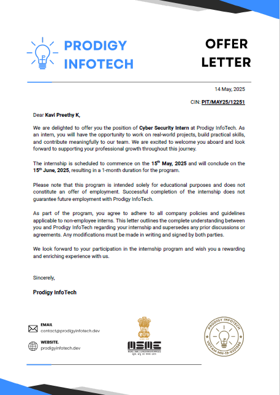

CYBER SECURITY INTERNSHIP AT PORDIGY_INFOTECH
-----------------------------------------------------------------------------------------------------------

During my 1 month[15/05/2025-15/06/2025] internship at Prodigy Infotech, I developed a Python programs related to cybersecurity. 
I created a basic encryption program to convert plain text into cipher text, and also worked on encrypting images using Python. 
I built a simple password strength checker, a keylogger, and a packet sniffing script—all using Python without any external tools. 
This hands-on experience helped me understand how these concepts work at a code level, and it was a great way to build my knowledge in cybersecurity using programming.

